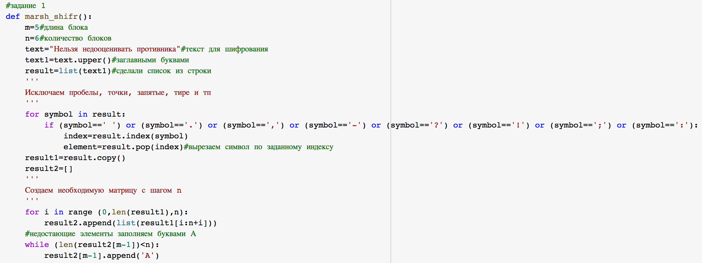
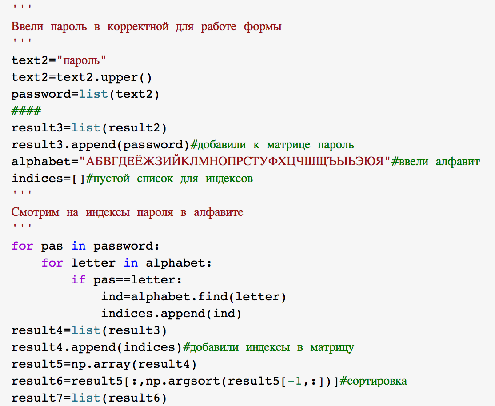
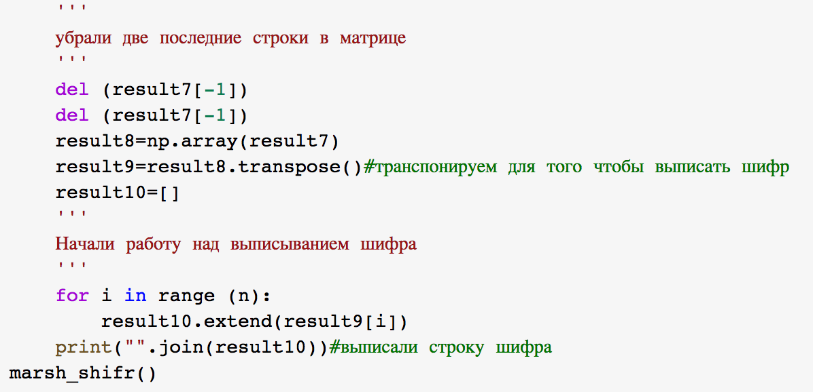
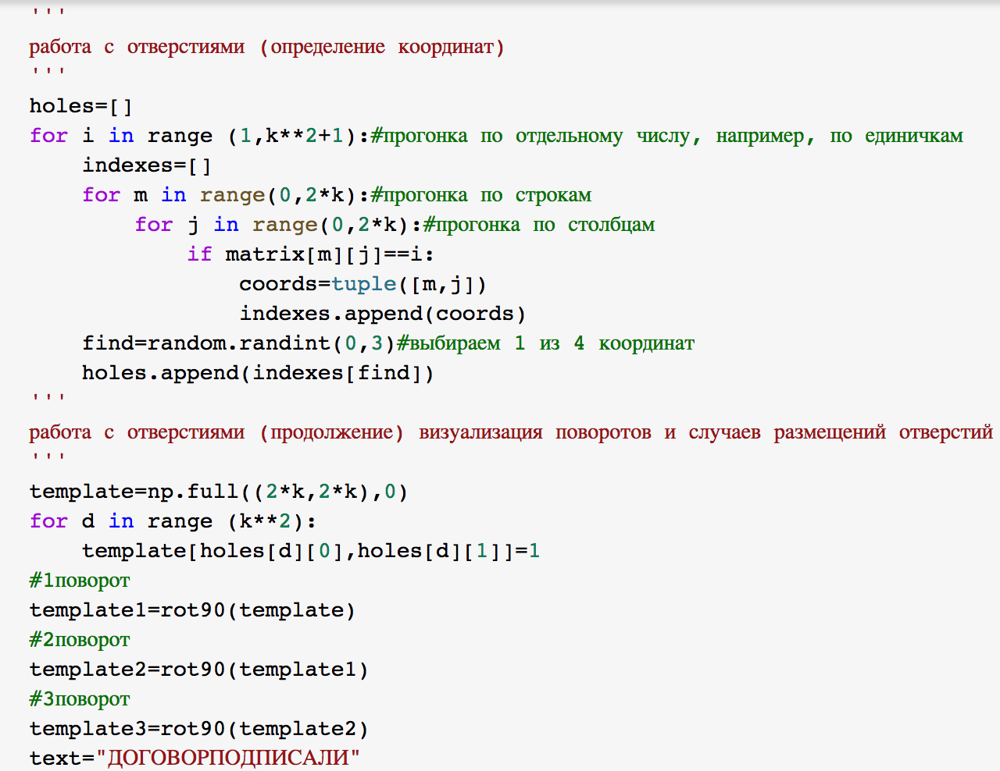
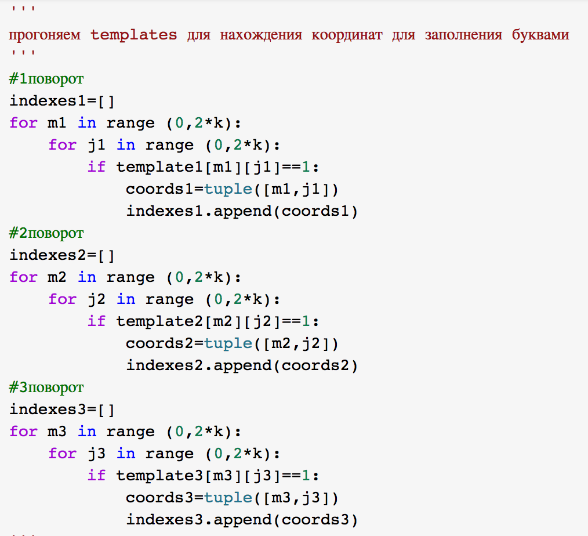

---
# Титульный лист
title: |
    Лабораторная работа №2.
    Шифры перестановки
author:
- "Студент: Банникова Екатерина Алексеевна"
- "Группа: НФИмд-02-23"
date: "Москва 2023"

# Общие опции
lang: ru-RU
toc-title: "Содержание"

# Библиография
bibliography: bib/cite.bib
csl: pandoc/csl/gost-r-7-0-5-2008-numeric.csl

# Конвертация в ПДФ
toc: true # Содержание
toc_depth: 2
lof: true # Список изображений
lot: true # Список таблиц
fontsize: 12pt
linestretch: 1.5
papersize: a4
documentclass: scrreprt

## I18n
polyglossia-lang:
  name: russian
  options:
	- spelling=modern
	- babelshorthands=true
polyglossia-otherlangs:
  name: english
### Шрифты
mainfont: PT Serif
romanfont: PT Serif
sansfont: PT Sans
monofont: PT Mono
mainfontoptions: Ligatures=TeX
romanfontoptions: Ligatures=TeX
sansfontoptions: Ligatures=TeX,Scale=MatchLowercase
monofontoptions: Scale=MatchLowercase,Scale=0.8
## Biblatex
biblatex: true
biblio-style: "gost-numeric"
biblatexoptions:
  - parentracker=true
  - backend=biber
  - hyperref=auto
  - language=auto
  - autolang=other*
  - citestyle=gost-numeric

## Misc options
indent: true
header-includes:
  - \linepenalty=10 # the penalty added to the badness of each line within a paragraph (no associated penalty node) Increasing the value makes tex try to have fewer lines in the paragraph.
  - \interlinepenalty=0 # value of the penalty (node) added after each line of a paragraph.
  - \hyphenpenalty=50 # the penalty for line breaking at an automatically inserted hyphen
  - \exhyphenpenalty=50 # the penalty for line breaking at an explicit hyphen
  - \binoppenalty=700 # the penalty for breaking a line at a binary operator
  - \relpenalty=500 # the penalty for breaking a line at a relation
  - \clubpenalty=150 # extra penalty for breaking after first line of a paragraph
  - \widowpenalty=150 # extra penalty for breaking before last line of a paragraph
  - \displaywidowpenalty=50 # extra penalty for breaking before last line before a display math
  - \brokenpenalty=100 # extra penalty for page breaking after a hyphenated line
  - \predisplaypenalty=10000 # penalty for breaking before a display
  - \postdisplaypenalty=0 # penalty for breaking after a display
  - \floatingpenalty = 20000 # penalty for splitting an insertion (can only be split footnote in standard LaTeX)
  - \raggedbottom # or \flushbottom
  - \usepackage{float} # keep figures where there are in the text
  - \floatplacement{figure}{H} # keep figures where there are in the text

  - \usepackage{titling}
  - \setlength{\droptitle}{-9em}
  - \pretitle{\begin{center}
      \textbf{РОССИЙСКИЙ УНИВЕРСИТЕТ ДРУЖБЫ НАРОДОВ}\\
      \textbf{Факультет физико-математических и естественных наук}\\
      \textbf{Кафедра теории вероятностей и кибербезопасности}
      \vspace{9cm}
      \LARGE\\}
  - \posttitle{\vskip 1em \Large \emph{\textit{Дисциплина$:$ Математические основы защиты информации и информационной безопасности}} \end{center}}
  - \preauthor{\vskip 3em \begin{flushright} \large \begin{tabular}[t]{c}}
  - \postauthor{\end{tabular}\par\end{flushright} \vfill \vskip 5em}
---

# Цель работы

Целью данной лабораторной работы является ознакомление с тремя методами шифрования: маршрутным шифрованием, шифрованием с помощью решеток, таблицей Виженера, -- а так же их реализация на произвольном языке программирования.

# Задание

1. Реализовать метод маршрутного шифрования.

2. Реализовать метод шифрования с помощью решеток.

3. Реализовать метод таблицы Вижера.

# Теоретическое введение

Математическая часть подробно описана в задании к лабораторной работе. Я поставила перед собой задачу найти исторические сведения, факты о методах шифрования.

**Шифр перестановки** — это метод симметричного шифрования, в котором элементы исходного открытого текста меняют местами. Элементами текста могут быть отдельные символы, пары букв, тройки букв, комбинирование этих случаев и так далее. Типичными примерами перестановки являются анаграммы. В классической криптографии шифры перестановки можно разделить на два класса:

1. Шифры одинарной (простой) перестановки — при шифровании символы открытого текста перемещаются с исходных позиций в новые один раз.
2. Шифры множественной (сложной) перестановки — при шифровании символы открытого текста перемещаются с исходных позиций в новые несколько раз.

Метод **маршрутного шифрования** изобрел французский математик и криптограф Франсуа Виет. Этот способ относится к перестановочным шифрам. Шифр называется перестановочным, если все связанные с ним криптограммы получаются из соответствующих открытых текстов перестановкой букв. Способ, каким при шифровании переставляются буквы открытого текста, и является ключом шифра. Такой метод шифрования (столбцовая перестановка) в годы первой мировой войны использовала легендарная немецкая шпионка Мата Хари.

**Шифровальная решётка** — трафарет с прорезями-ячейками (из бумаги, картона или аналогичного материала), использовавшийся для шифрования открытого текста. Текст наносился на лист бумаги через такой трафарет по определённым правилам, и расшифровка текста была возможна только при наличии такого же трафарета.

**Вращающаяся решетка**: Прямоугольные решётки Кардано можно размещать в четырёх позициях. Шифр с сеткой в виде шахматной доски имеет только две позиции, но именно этот вариант вращающейся решётки послужил для разработки более сложной решётки с четырьмя позициями, которую можно вращать в двух направлениях.

**Шифр Виженера** является простой формой многоалфавитной замены. Шифр Виженера изобретался многократно. Впервые этот метод описал Джован Баттиста Беллазо (итал. Giovan Battista Bellaso) в книге La cifra del. Sig. Giovan Battista Bellasо в 1553 году, однако в XIX веке получил имя Блеза Виженера, французского дипломата. Метод прост для понимания и реализации, он является недоступным для простых методов криптоанализа.

# Выполнение лабораторной работы

**Примечание:** комментарии по коду представлены на скриншотах к каждому из проделанных заданий.

## Маршрутное шифрование

В соответствии с заданием, первой была написана программа для маршрутного шифрования. Программный код представлен ниже.

{ #fig:001 width=100% }

{ #fig:002 width=70% }

{ #fig:003 width=80% }

Результаты выполнения программы представлены ниже. В качестве параметров системы были взяты данные из описательной части лабораторной работы портала ТУИС.

{ #fig:004 width=70% }

## Метод решеток

{ #fig:005 width=70% }

{ #fig:006 width=70% }

{ #fig:007 width=70% }

{ #fig:008 width=70% }

{ #fig:009 width=70% }

Результаты выполнения программы представлены ниже. В качестве параметров системы были взяты данные из описательной части лабораторной работы портала ТУИС.

{ #fig:010 width=70% }

## Таблица Виженера

Ну и наконец мы перешли к шифрованию при помощи таблицы Виженера. Программный код представлен ниже.

{ #fig:011 width=100% }

{ #fig:012 width=90% }

{ #fig:013 width=100% }

{ #fig:014 width=70% }

Результаты выполнения программы представлены ниже. В качестве параметров системы были взяты данные из описательной части лабораторной работы портала ТУИС.

{ #fig:015 width=70% }

# Выводы

Таким образом, была достигнута цель, поставленная в начале лабораторной работы: я ознакомилась с тремя методами шифрования -- маршрутным шифрованием, шифрованием с помощью решеток, таблицей Виженера, -- а так же мне удалось реализовать их на языке программирования Python.

# Список литературы
1. Википедия. Перестановочный шифр [Электронный ресурс]. Википедия,
свободная энциклопедия. URL: https://en.wikipedia.org/wiki/Tran
sposition_cipher.
2. VK. Метод маршрутного шифрования [Электронный ресурс]. VK, 2018.
URL: https://vk.com/@cryptandcod-metod-marshrutnogo-shifrovaniya.
3. Википедия. Шифровальная решетка [Электронный ресурс]. Википедия,
свободная энциклопедия. URL: https://en.wikipedia.org/wiki/Gril
le_(cryptography).
4. Wix. Криптография [Электронный ресурс]. Wixsite, 2021. URL: https://en.w
ikipedia.org/wiki/Grille_(cryptography).
5. Википедия. Шифр Виженера [Электронный ресурс]. Википедия, свобод-
ная энциклопедия. URL: https://en.wikipedia.org/wiki/Vigen%C3%A
8re_cipher.

::: {#refs}
:::
