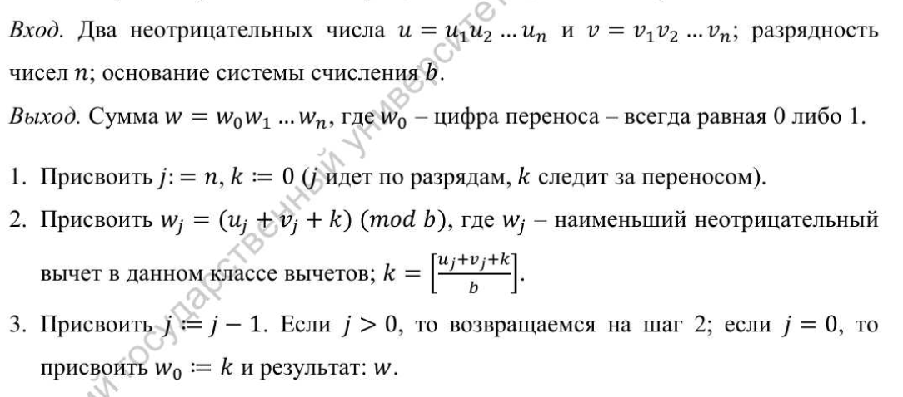
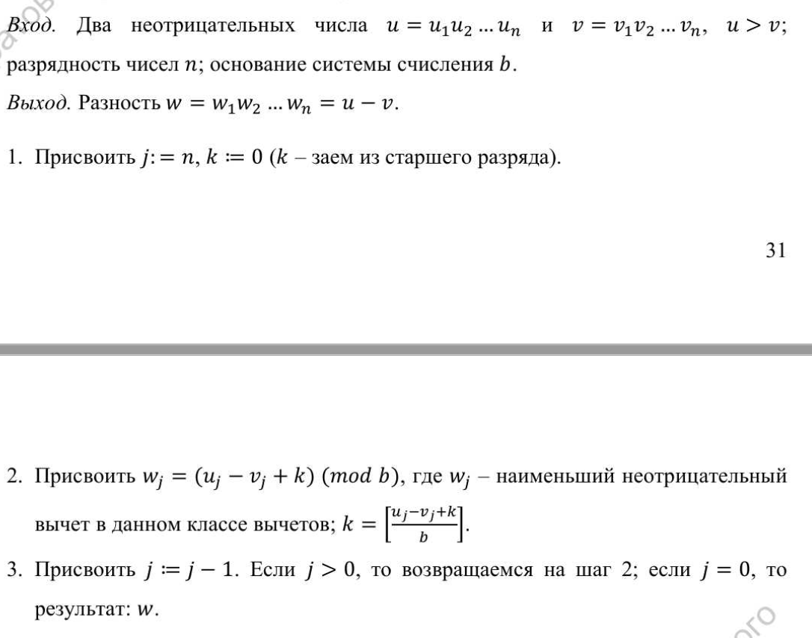
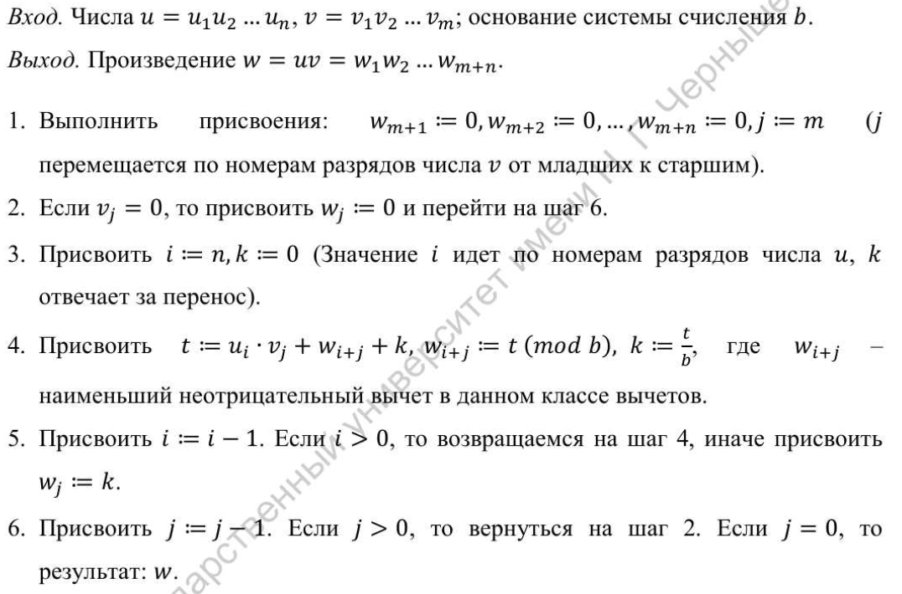
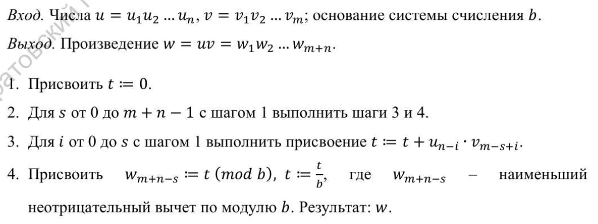
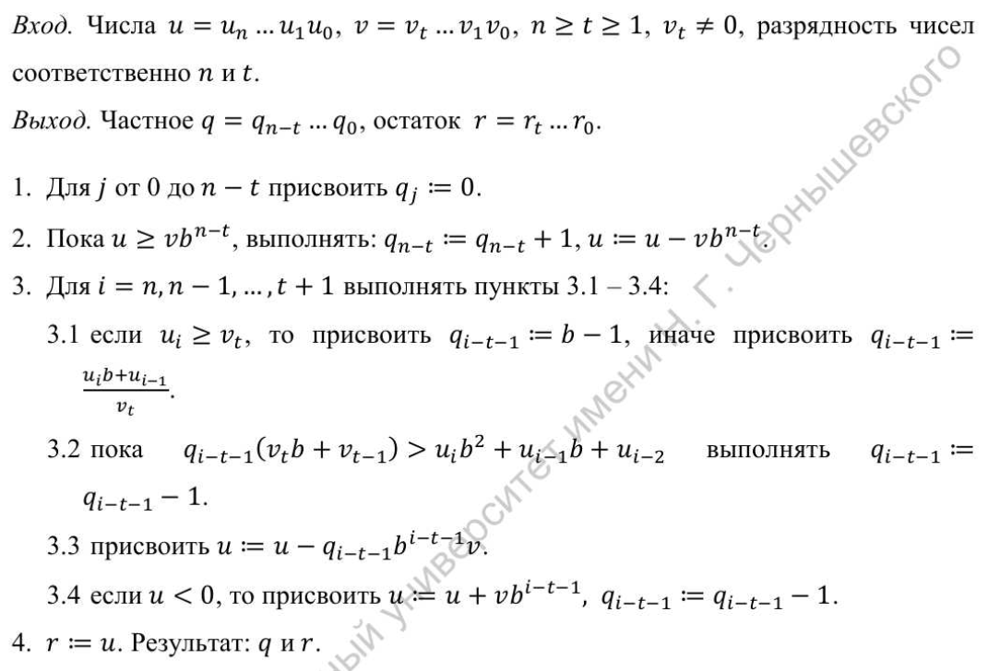
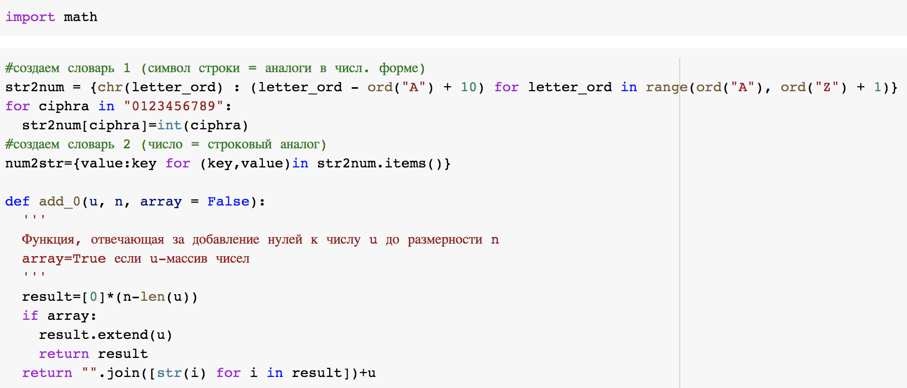
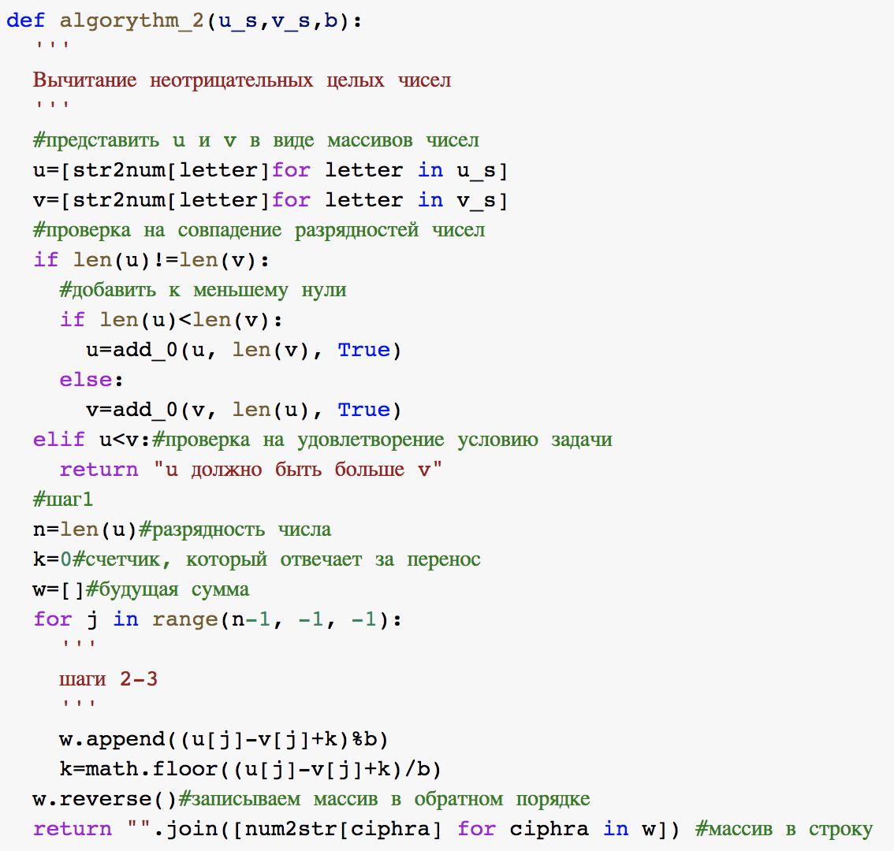
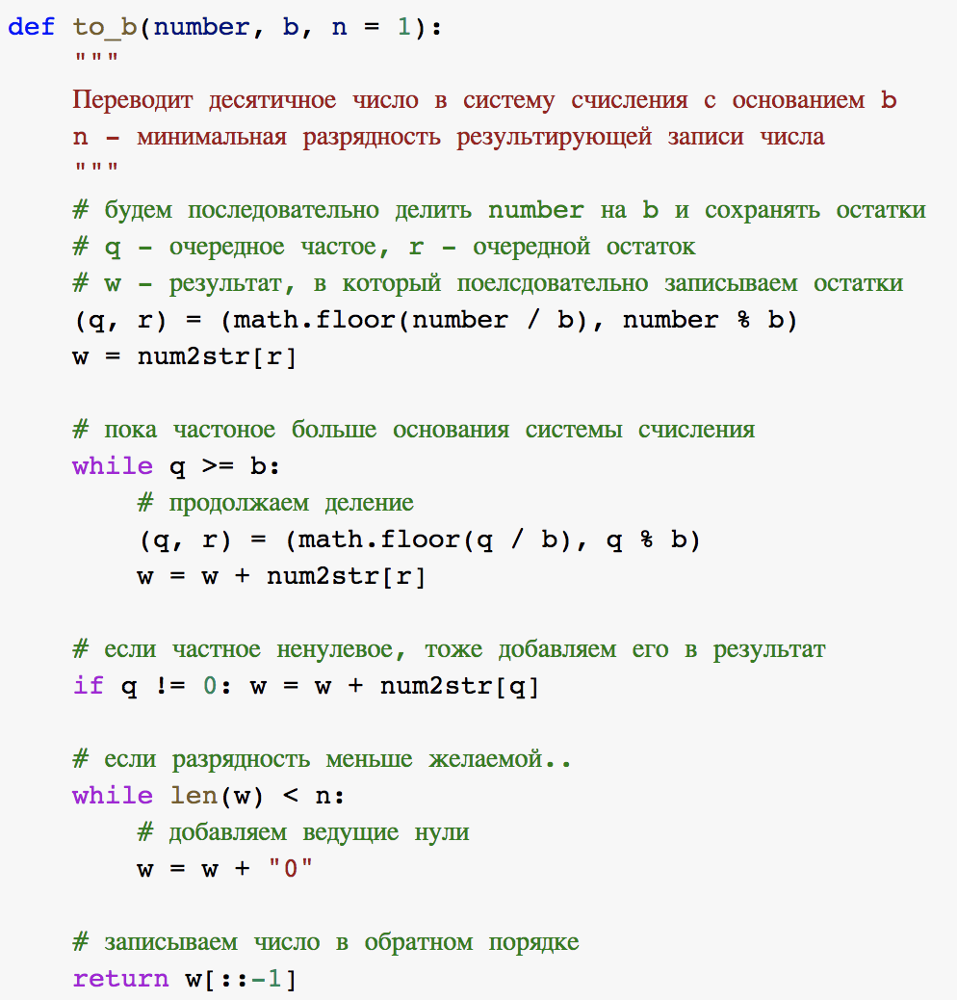
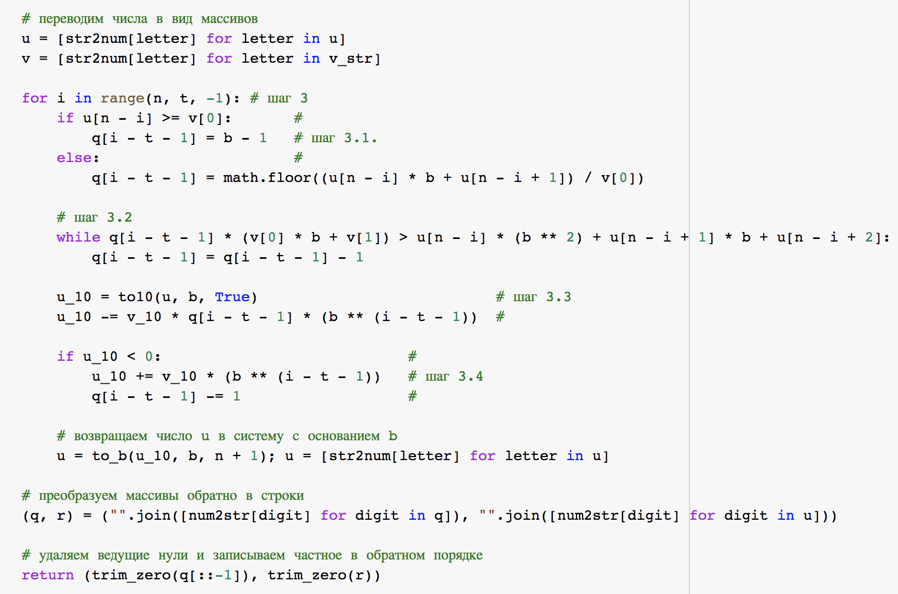

---
# Титульный лист
title: |
    Отчёт по лабораторной работе №8.  
    Целочисленная арифметика многократной точности
author:
- "Студент: Банникова Екатерина Алексеевна"
- "Группа: НФИмд-02-23"
date: "Москва 2023"

# Общие опции
lang: ru-RU
toc-title: "Содержание"

# Библиография
bibliography: bib/cite.bib
csl: pandoc/csl/gost-r-7-0-5-2008-numeric.csl

# Конвертация в ПДФ
toc: true # Содержание
toc_depth: 2
lof: true # Список изображений
lot: true # Список таблиц
fontsize: 12pt
linestretch: 1.5
papersize: a4
documentclass: scrreprt

## I18n
polyglossia-lang:
  name: russian
  options:
	- spelling=modern
	- babelshorthands=true
polyglossia-otherlangs:
  name: english
### Шрифты
mainfont: PT Serif
romanfont: PT Serif
sansfont: PT Sans
monofont: PT Mono
mainfontoptions: Ligatures=TeX
romanfontoptions: Ligatures=TeX
sansfontoptions: Ligatures=TeX,Scale=MatchLowercase
monofontoptions: Scale=MatchLowercase,Scale=0.8
## Biblatex
biblatex: true
biblio-style: "gost-numeric"
biblatexoptions:
  - parentracker=true
  - backend=biber
  - hyperref=auto
  - language=auto
  - autolang=other*
  - citestyle=gost-numeric

## Misc options
indent: true
header-includes:
  - \linepenalty=10 # the penalty added to the badness of each line within a paragraph (no associated penalty node) Increasing the value makes tex try to have fewer lines in the paragraph.
  - \interlinepenalty=0 # value of the penalty (node) added after each line of a paragraph.
  - \hyphenpenalty=50 # the penalty for line breaking at an automatically inserted hyphen
  - \exhyphenpenalty=50 # the penalty for line breaking at an explicit hyphen
  - \binoppenalty=700 # the penalty for breaking a line at a binary operator
  - \relpenalty=500 # the penalty for breaking a line at a relation
  - \clubpenalty=150 # extra penalty for breaking after first line of a paragraph
  - \widowpenalty=150 # extra penalty for breaking before last line of a paragraph
  - \displaywidowpenalty=50 # extra penalty for breaking before last line before a display math
  - \brokenpenalty=100 # extra penalty for page breaking after a hyphenated line
  - \predisplaypenalty=10000 # penalty for breaking before a display
  - \postdisplaypenalty=0 # penalty for breaking after a display
  - \floatingpenalty = 20000 # penalty for splitting an insertion (can only be split footnote in standard LaTeX)
  - \raggedbottom # or \flushbottom
  - \usepackage{float} # keep figures where there are in the text
  - \floatplacement{figure}{H} # keep figures where there are in the text

  - \usepackage{titling}
  - \setlength{\droptitle}{-9em}
  - \pretitle{\begin{center}
      \textbf{РОССИЙСКИЙ УНИВЕРСИТЕТ ДРУЖБЫ НАРОДОВ}\\
      \textbf{Факультет физико-математических и естественных наук}
      \vspace{9cm}
      \LARGE\\}
  - \posttitle{\vskip 1em \Large \emph{\textit{Дисциплина$:$ Математические основы защиты информации и информационной безопасности}} \end{center}}
  - \preauthor{\vskip 3em \begin{flushright} \large \begin{tabular}[t]{c}}
  - \postauthor{\end{tabular}\par\end{flushright} \vfill \vskip 5em}
---

# Цель работы

Целью данной лабораторной работы является ознакомление с алгоритмами по воплощению целочисленной арифметики многократной точности, а также программная реализация данных алгоритмов.

# Задание

Реализовать рассмотренные в инструкции к лабораторной работе алгоритмы программно.

Алгоритмы:

1. Сложение неотрицательных целых чисел

2. Вычитание неотрицательных целых чисел

3. Умножение неотрицательных целых чисел столбиком

4. Быстрый столбик

5. Деление многоразрядных целых чисел

# Теоретическое введение

В данной лабораторной работе предметом нашего изучения стали алгоритмы по воплощению целочисленной арифметики многократной точности.

## Арифметика многократной точности

Арифметика многократной точности — это операции (базовые арифметические действия, элементарные математические функции и пр.) над числами большой разрядности, т.е. числами, разрядность которых превышает длину машинного слова универсальных процессоров общего назначения (более 128 бит).

В современных асимметричных криптосистемах в качестве ключей, как правило, используются целые числа длиной 1000 и более битов. Для задания чисел такого размера не подходит ни один стандартный целочисленный тип данных современных языков программирования.

При работе с большими целыми числами знак такого числа удобно хранить в отдельной переменной. Например, при умножении двух чисел знак произведения вычисляется отдельно.

Далее нами были рассмотрены алгоритмы по воплощению целочисленной арифметики многократной точности.

## Сложение неотрицательных целых чисел

{ #fig:001 width=70% }

## Вычитание неотрицательных целых чисел

{ #fig:002 width=70% }

## Умножение неотрицательных целых чисел столбиком

{ #fig:003 width=70% }

## Быстрый столбик

{ #fig:004 width=70% }

## Деление многоразрядных целых чисел

{ #fig:005 width=70% }

# Выполнение лабораторной работы

**Примечание:** комментарии по коду представлены на скриншотах к каждому из проделанных заданий.

В соответствии с заданием, были написаны программы по воплощению алгоритмов, представленных в описании к лабораторной работе.

Программный код и результаты выполнения программ представлены ниже.

## Вспомогательные действия

{ #fig:006 width=70% }

## Алгоритм 1. Сложение неотрицательных целых чисел. Реализация

{ #fig:007 width=70% }

## Алгоритм 1. Сложение неотрицательных целых чисел. Результат

{ #fig:008 width=70% }

## Алгоритм 2. Вычитание неотрицательных целых чисел. Реализация

{ #fig:009 width=70% }

## Алгоритм 2. Вычитание неотрицательных целых чисел. Результат

{ #fig:010 width=70% }

## Алгоритм 3. Умножение неотрицательных целых чисел столбиком. Реализация

{ #fig:011 width=70% }

## Алгоритм 3. Умножение неотрицательных целых чисел столбиком. Результат

{ #fig:012 width=70% }

## Алгоритм 4. Быстрый столбик. Реализация

{ #fig:013 width=70% }

## Алгоритм 4. Быстрый столбик. Результат

{ #fig:014 width=70% }

## Алгоритм 5. Деление многоразрядных целых чисел. Реализация

{ #fig:015 width=70% }

## Алгоритм 5. Деление многоразрядных целых чисел. Реализация

{ #fig:016 width=30% }

## Алгоритм 5. Деление многоразрядных целых чисел. Реализация

{ #fig:017 width=70% }

## Алгоритм 5. Деление многоразрядных целых чисел. Реализация

{ #fig:018 width=30% }

## Алгоритм 5. Деление многоразрядных целых чисел. Реализация

{ #fig:019 width=20% }

## Алгоритм 5. Деление многоразрядных целых чисел. Результат

{ #fig:020 width=70% }

# Выводы

Таким образом, была достигнута цель, поставленная в начале лабораторной работы: в результате выполнения данной лабораторной работы нам удалось осуществить программно алгоритмы, рассмотренные в описании к лабораторной работе, а также мы осуществили программно данные алгоритмы.

# Список литературы{.unnumbered}
1. Исупов К.С. Методы и алгоритмы организации высокоточных вычислений в арифметике остаточных классов для универсальных процессорных платформ: phdthesis. Вятский государственный университет, 2014.
2. Панкратова И.А. Теоретико-числовые методы в криптографии: учебное пособие. Томск: Томский государственный университет, 2009. С. 120.
3. Бубнов С.А. Лабораторный практикум по основам криптографии: учебно-методическое пособие. Саратов; http://elibrary.sgu.ru/uch_lit/656.pdf: Саратовский государственный университет им. Н.Г. Чернышевского, 2012.

::: {#refs}
:::
